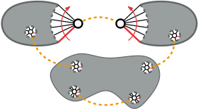
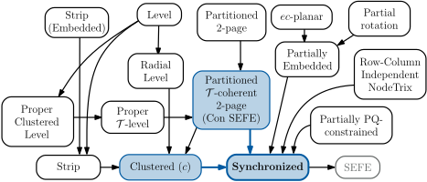
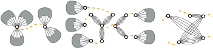
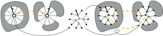
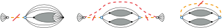
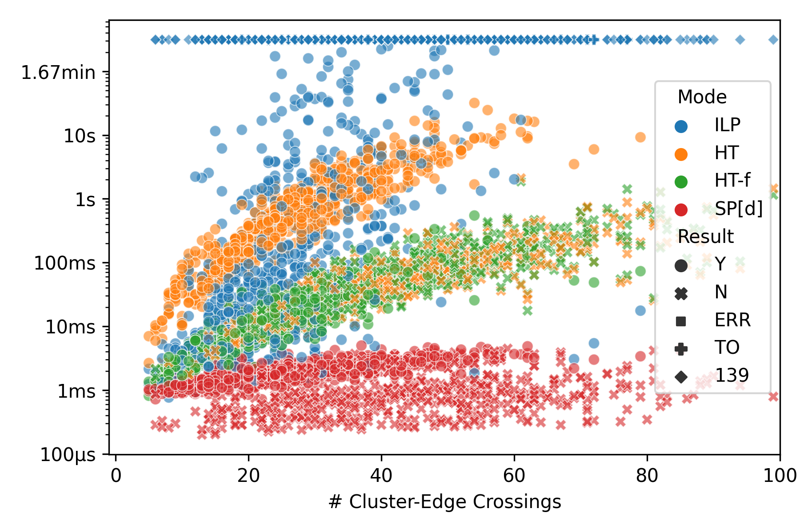

# Synchronized Planarity

> [!NOTE]
> This code has been [merged into](https://github.com/ogdf/ogdf/blob/master/include/ogdf/cluster/sync_plan/SyncPlan.h) the OGDF master branch, see also its documentation [here](https://ogdf.netlify.app/classogdf_1_1sync__plan_1_1_sync_plan.html).
> To use it, either directly build the OGDF master branch or use any OGDF release newer than `elderberry (2023.09)` (which at the point of writing does not exist yet).
> 
> This repository is only kept for archival purposes and to still provide the evaluation harness used in the paper.

This repository contains a C++ implementation of the quadratic-time Synchronized Planarity
algorithm by Bläsius, Fink and Rutter presented at [ESA'21](https://drops.dagstuhl.de/opus/volltexte/2021/14600/).
In Synchronized Planarity, we are given *pipes* matching pairs of vertices of a graph
and we seek a planar embedding where the rotations of paired vertices line up under a given bijection (see the Figure on the right).
This can be used to efficiently solve various Constrained Planarity variants,
with reductions from Clustered Planarity and Connected SEFE provided here (see the Figure below).

<p align="center">

</p>

## Implementation

The implementation is based on the Open Graph algorithms and Data structures
Framework [OGDF](https://github.com/ogdf/ogdf)
and, as only other dependency, uses the [PC-tree implementation](https://github.com/N-Coder/pc-tree/) by Pfretzschner,
Fink and Rutter
presented at [ESA'21](https://drops.dagstuhl.de/opus/volltexte/2021/14624/).
The main class is [`PQPlanarity`](include/PQPlanarity.h), which allows for manually creating
Synchronized Planarity instances and provides methods for
[reducing](src/solve/MakeReduced.cpp) them (using the operations shown in the Figure below),
[solving](src/solve/Solver.cpp) them (using an SPQR-tree together with a 2-SAT instance synchronizing rigids and
Q-vertices),
and also for generating an [embedding](src/solve/Embedder.cpp) of the original instance from a solved reduced instance
(by undoing all structural changes while maintaining the embedding).
The class also provides constructors for the reductions from other problems.
Pipes and P-vertices are managed by [`PMatching`](src/PMatching.cpp),
Q-vertices and their partitions are managed by [`QPartitioning`](src/QPartitioning.cpp).
As the adjacency-list representation of OGDF Graphs carries an implicit rotation for each vertex, this is used represent
the default rotation for Q-vertices.
The [bijection](src/utils/Bijection.cpp) between the incident edges of two matched P-vertices is also given by the
clockwise rotation of the one and the counter-clockwise rotation of the other vertex, matched up using at first and
respectively last entries of the adjacency lists (see [here](src/utils/Bijection.cpp) how the bijection is generated).
The connectivity information needed during the reduce phase is maintained
by [`PQPlanarityComponents`](src/PQPlanarityComponents.cpp),
whose consistency is checked in debug builds by [`PQPlanarityConsistency`](src/PQPlanarityConsistency.cpp).
The order in which pipes are processed can be configured by providing an appropriate [`PipeQueue`](include/PipeOrder.h)
to `PMatching`,
while boolean flags on `PQPlanarity` allow toggling various other optional behaviors.
See the main functions of one of the executables, e.g. [profile-pqplan](src/exec/profile-pqplan.cpp), for usage
examples.

<table width="100%" align="center">
<tr><td align="center"></td></tr>
<tr><td align="center"></td></tr>
<tr><td align="center"></td></tr>
<tr><td>

Operations [Encapsulate](src/operation/Encapsulate.cpp)AndJoin aka [Contract](src/operation/Contract.cpp), [PropagatePQ](src/operation/Propagate.cpp) and [Simplify](src/operation/Simplify.cpp)

</td></tr>
</table>

## Installation and Building

The project together with its two dependencies is built using CMake and a C++ compiler of your choice.
The [Dockerfile](install/Dockerfile) provides a simple Docker container with a prepared build environment,
see also there for recommended Debian packages to install when building directly on your own system.
The [setup script](install/setup.sh) can be used to automatically clone the right versions of the
[ogdf](https://github.com/N-Coder/ogdf/tree/syncplan) and [pc-tree](https://github.com/N-Coder/pc-tree/tree/syncplan)
repos (using branches with the slight modifications required for this project)
next to the syncplan directory.
The script also sets up the CMake release and debug build directories with the right flags and paths for dependent
projects,
and installs all [required python packages](install/requirements.txt).
The CMake flags are set as follows:

```bash
# ogdf/build-debug
cmake .. -DCMAKE_BUILD_TYPE=Debug -DCMAKE_INTERPROCEDURAL_OPTIMIZATION=FALSE -DBUILD_SHARED_LIBS=ON \
         -DOGDF_MEMORY_MANAGER=POOL_NTS \
         -DOGDF_USE_ASSERT_EXCEPTIONS=ON -DOGDF_USE_ASSERT_EXCEPTIONS_WITH_STACK_TRACE=ON_LIBUNWIND
# ASSERT_EXCEPTIONS config is recommended for easier debugging of the OGDF

# ogdf/build-release
cmake .. -DCMAKE_BUILD_TYPE=Release -DCMAKE_INTERPROCEDURAL_OPTIMIZATION=TRUE -DBUILD_SHARED_LIBS=OFF \
         -DOGDF_MEMORY_MANAGER=POOL_NTS -DOGDF_USE_ASSERT_EXCEPTIONS=OFF

# pc-tree/build-debug
cmake .. -DCMAKE_BUILD_TYPE=Debug -DCMAKE_INTERPROCEDURAL_OPTIMIZATION=FALSE -DBUILD_SHARED_LIBS=ON \
         -DOGDF_DIR=../../ogdf/build-debug

# pc-tree/build-release
cmake .. -DCMAKE_BUILD_TYPE=Release -DCMAKE_INTERPROCEDURAL_OPTIMIZATION=TRUE -DBUILD_SHARED_LIBS=OFF \
         -DOGDF_DIR=../../ogdf/build-release

# syncplan/build-debug
cmake .. -DCMAKE_BUILD_TYPE=Debug -DCMAKE_INTERPROCEDURAL_OPTIMIZATION=FALSE -DBUILD_SHARED_LIBS=ON \
         -DOGDF_DIR=../../ogdf/build-debug -DPCTree_DIR=../../pc-tree/build-debug

# syncplan/build-release
cmake .. -DCMAKE_BUILD_TYPE=Release -DCMAKE_INTERPROCEDURAL_OPTIMIZATION=TRUE -DBUILD_SHARED_LIBS=OFF \
         -DOGDF_DIR=../../ogdf/build-release -DPCTree_DIR=../../pc-tree/build-release
```

## Binaries

The build produces the following executable binaries, see their source code and usage texts for arguments.
<dl>
<dt><a href="src/exec/cplan.cpp">cplan</a></dt>
<dd>Tests and optionally embeds and draws an instance of Clustered Planarity.</dd>

<dt><a href="src/exec/pqplan.cpp">pqplan</a></dt>
<dd>Tests and optionally embeds and draws an instance of Synchronized Planarity.</dd>

<dt><a href="src/exec/profile-cplan.cpp">profile-cplan</a></dt>
<dd>Uses one of the SyncPlan, CConnected, HananiTutte or ILP implementations to solve an instance of Clustered Planarity,
additionally printing runtime profiling data in JSON format.</dd>

<dt><a href="src/exec/profile-pqplan.cpp">profile-pqplan</a></dt>
<dd>Uses the SyncPlan implementation to solve an instance of Synchronized Planarity,
additionally printing runtime profiling data in JSON format.</dd>

<dt><a href="src/exec/make-cluster-index.cpp">make-cluster-index</a></dt>
<dd>Print JSON meta-information on multiple Clustered Planarity instances.</dd>

<dt><a href="src/exec/make-pq-index.cpp">make-pq-index</a></dt>
<dd>Print JSON meta-information on multiple Synchronized Planarity instances.</dd>

<dt><a href="src/exec/preprocess-cplan.cpp">preprocess-cplan</a></dt>
<dd>Apply the preprocessing rules by Gutwenger et al. on a Clustered Planarity instance.</dd>

<dt><a href="src/exec/random-cplan.cpp">random-cplan</a></dt>
<dd>Generate a random clustering on the given graph using one of three different generators
(two OGDF generators that mostly yield no-instances, and our own yes-instance generator).</dd>

<dt><a href="src/exec/random-lplan.cpp">random-lplan</a></dt>
<dd>Generate a random (radial) level planar graph and reduce it to an instance of synchronized planarity.</dd>

<dt><a href="src/exec/random-pqplan.cpp">random-pqplan</a></dt>
<dd>Generate random pipes on the given graph using one of two different generators
(match up random vertices or use the reduction from a random SEFE instance).</dd>
</dl>
Note that when flag `PQ_OPSTATS` is defined (the default), an additional file with per-operation
profiling information will be generated.
Furthermore, the commandline flag for dumping the instance after each applied operation is only available in debug builds.

## Evaluation

The datasets we used for our evaluation are archived on [Zenodo](https://zenodo.org/record/7896022).
Running the evaluation requires a [slurm](https://slurm.schedmd.com/) cluster for running the experiments
and a [MongoDB](https://www.mongodb.com/) for storing the results.
To simplify the reproduction of our results, both can also be provided via Docker, but please note that
running our evaluation on the larger instances in the larger datasets can take a very long time when not parallelized on
a cluster.
The [tools](tools) directory contains many scrips helping with automating the evaluation,
see the following for examples of their usage.
The following bash commands set up MongoDB and Slurm within Docker containers, run the build,
generate some test data and perform the evaluation on a small data set, yielding the plot shown below.

<!--
# Infosun Cluster
export HOME=/scratch/$USER
alias docker="podman --root=/local/$USER/podman"
-->
```bash
# create a virtual network and start a MongoDB instance 
docker network create sp-net
docker run --name sp-mongo --network sp-net --publish 27017:27017 --detach mongo

# build the image and start the container
wget https://github.com/N-Coder/syncplan/raw/main/install/Dockerfile
docker build --no-cache --pull --tag sp-image .
docker run --name sp-slurm --network sp-net --publish 8888:8888 --tty --interactive sp-image /bin/bash

# now, run the setup within the container (e.g. root@9b8368ef788c:~# )
cd /root/
wget https://raw.githubusercontent.com/N-Coder/syncplan/main/install/setup.sh
chmod +x setup.sh
./setup.sh

# setup the slurm "cluster"
# create the slurm config file for the current host (need to be recreated when the hostname changes, i.e. when the container is re-created)
syncplan/install/slurm-install.sh
# start the slurm daemon (this needs to be done every time you re-enter the container)
syncplan/install/slurm-start.sh

# set all required environment variables
export OGDF_BUILD_DIR="/root/ogdf/build-debug" # used by ogdf-python
export SP_PLOT_DIR="/root/plots" # output directory
export SP_MONGO_URL="mongodb://sp-mongo:27017/?directConnection=true"
export SP_MONGO_DB="syncplan" # name of DB
export SP_TOOLS_DIR="/root/syncplan/tools"
export SP_BUILD_DIR="/root/syncplan/build-release"

# now lets work on the datasets
mkdir datasets
cd datasets

# download some of our datasets
wget -O dsold.tar.gz https://zenodo.org/record/7896022/files/dsold.tar.gz?download=1
tar -xaf dsold.tar.gz
# yields index-dsold.csv for directory dsold/

# or create your own dataset (see the comments in make-instances.sh for the deterministic config we used)
suffix=testing # also set in make-instances.sh
$SP_TOOLS_DIR/make-instances.sh # yields directory clusters-$suffix/
watch squeue # wait for all slurm jobs to finish
python3 $SP_TOOLS_DIR/evaluation.py make-index clusters-$suffix index-$suffix.csv # create index-$suffix.csv

# configure which dataset to use
export SP_COLLECTION="stats_dsold" # name of MongoDB collection for storing results
export SP_INDEX="index-dsold.csv" # path to index file
export SP_PROFILE_MODE="c" # the are clustered planarity instances
# export SP_PROFILE_MODE="pq" # for synchronized planarity instances
# export SP_MAX_IDX=1000 # can be set to only process some of the instances

# dry-run the evaluation on a single instance x method combination
python3 $SP_TOOLS_DIR/evaluation.py profile -m PQPlanarity -n 123 -sv

# start the evaluation on the whole dataset!
$SP_TOOLS_DIR/profile-old.sh # using one SyncPlan variant, HananiTutte, ILP
$SP_TOOLS_DIR/profile-variants.sh # or using all SyncPlan variants

# after all jobs are done...
python3 $SP_TOOLS_DIR/evaluation.py # lists further utilities, like:
python3 $SP_TOOLS_DIR/evaluation.py find-missing # check for missing runs
python3 $SP_TOOLS_DIR/evaluation.py read-opstats -d . # read per-operation profiling files to DB

# clean-up
ls -l --hide=*.json.gz --hide=slurm-*
mkdir opstats
for d in 0 1 2 3 4 5 6 7 8 9 a b c d e f; do mv $d*.json.gz opstats; done # move all read opstats files
find . -maxdepth 1 -type f -name "slurm-*.out" -empty -delete # remove empty slurm log files
find . -maxdepth 1 -type f -name "slurm-*.out" -size 173c -delete # remove slurm log files of certain size
mkdir log
mv slurm-* log # store remaining log files
ls -l

# check for missing / weird data in DB
# mongosh syncplan --eval 'db.stats_dsold.find(...)'
# {exit_code: {$nin: [0, 9, 124, 137]}, mode: {$ne: "ILP"}} # check for crashes (ignoring ILP)
# {opstats: null, opstats_error: null} # check for runs missing opstats

# generate plots
python3 $SP_TOOLS_DIR/plot/plot.py
```


